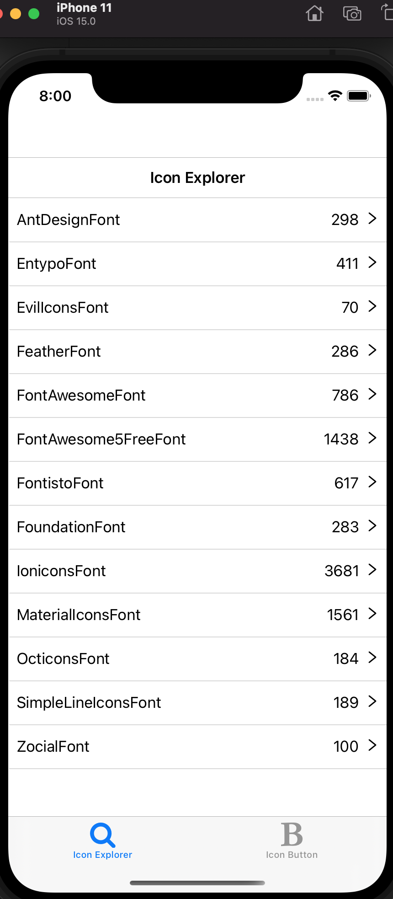
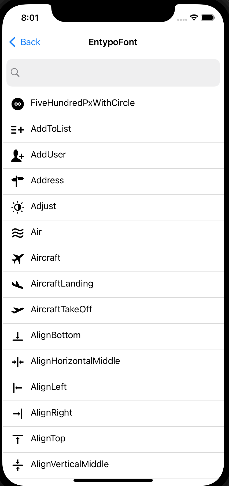
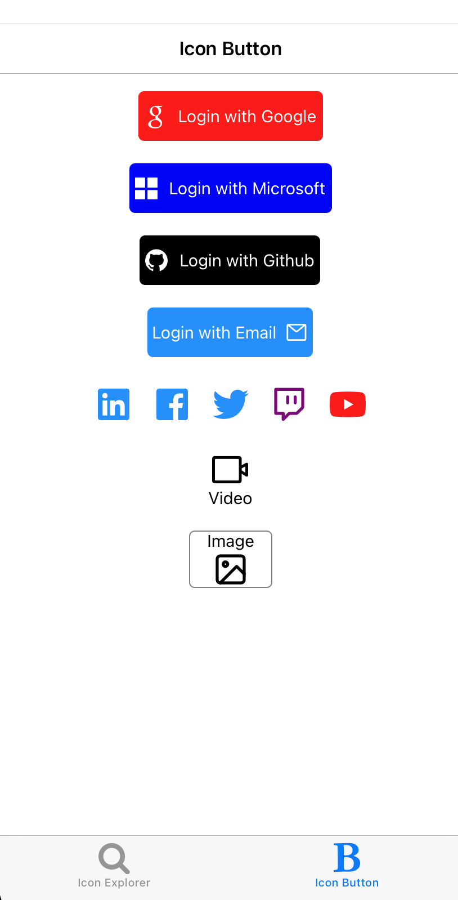
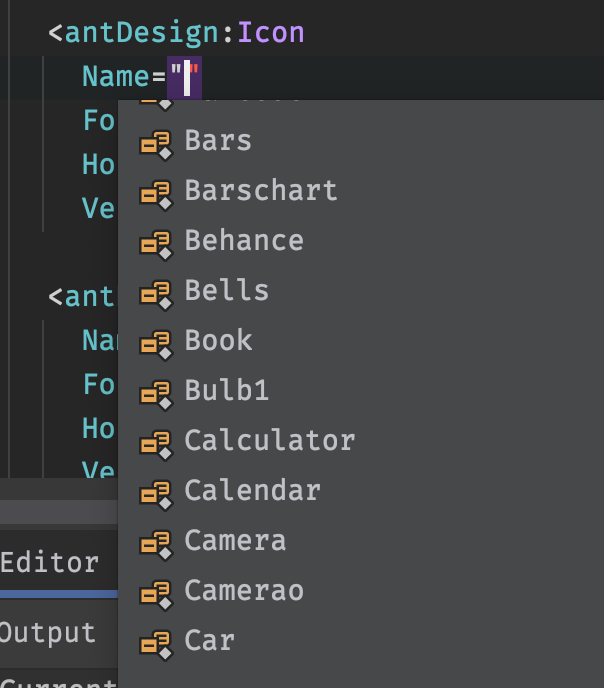

# MKit.VectorIcons

## What's included?

* Over 7000+ icons all in one nuget package installation.
* Support intellisense for name of icon.
* Include `Icon` and `IconButton`

Check out included sample app in sample folder for list of all icons.








## Support platforms

- [x] Android
- [x] iOS
- [x] UWP

## Setup

* Available on Nuget: https://www.nuget.org/packages/MKit.VectorIcons/

* Install it to .NET standard project.

  ```csharp
   <PackageReference Include="MKit.VectorIcons" Version="1.0.2" />
  ```

## Usage

Add MKit.VectorIcons Assembly Reference to `xaml` file.

```xaml
<?xml version="1.0" encoding="utf-8" ?>
<ContentPage
  x:Class="VectorIconsAppSample.MainPage"
  xmlns="http://xamarin.com/schemas/2014/forms"
  xmlns:x="http://schemas.microsoft.com/winfx/2009/xaml"
  xmlns:antDesign="clr-namespace:MKit.VectorIcons.AntDesign;assembly=MKit.VectorIcons"
  xmlns:fontAwesome="clr-namespace:MKit.VectorIcons.FontAwesome;assembly=MKit.VectorIcons"
  xmlns:materialIcons="clr-namespace:MKit.VectorIcons.MaterialIcons;assembly=MKit.VectorIcons">
```

And use it:

## Icon Font
Example for `AntDesign` and `FontAwesome`:

```xaml
    <antDesign:Icon
      Name="Addusergroup"
      FontSize="40"
      HorizontalOptions="Center"
      VerticalOptions="Center" />

    <fontAwesome:Icon 
       Name="Automobile" />
```

## Icon Button

Example for `MaterialIcon` IconButton:

```xaml
    <materialIcons:IconButton
      Name="Agriculture"
      Padding="8"
      BackgroundColor="LightSeaGreen"
      HorizontalOptions="Center"
      IconColor="White"
      Text="My car"
      TextColor="White" />
```

# Icon Image Source
```xaml
  <Image>
      <Image.Source>
          <antDesign:IconFontImageSource Name="Amazon" />
      </Image.Source>
  </Image>

  <Image>
      <Image.Source>
          <materialIcons:IconFontImageSource Name="Airplay" />
      </Image.Source>
  </Image>
  
  <Image>
      <Image.Source>
          <fontAwesome:IconFontImageSource Name="Bandcamp" />
      </Image.Source>
  </Image>
```


Both Icon & IconButton support intellisence for name of the Icon. 




## What works

All icons for these fonts:

- [x] AntDesign
- [x] Entypo
- [x] EvilIcons
- [x] Feather
- [x] FontAwesome
- [x] FontAwesome5 Free Regular & Solid
- [x] Fontisto
- [x] Foundation
- [x] Ionicons
- [x] MaterialIcons ( except `Goat` icon, see reason below)
- [x] Octicons
- [x] SimpleLineIcons
- [x] Zocial

## What doesn't work

Any font codes that has unicode value greater than 2 bytes

(x)  MaterialCommunityIcons  (99% of the icons have font codes value greater than 2 bytes)

(x)  FontAwesome5 Brand. (WIP) due to Glyph json file for FontAwesome5 combine all 3 regular solid & brand, this is fixable by create a seperate Glyph json file for FontAwesome 5 brand. 

(x)  FontAwesome5 Pro, due to I've never purchased and use it before. 


## Credit:

* This project was inspired by `react-native-vector-icons` project, and I also use their generated Glyphmaps json, while it is possible to download and generate the glyph using fonts provider source (see [Download Scripts](https://github.com/oblador/react-native-vector-icons/tree/master/scripts). But I like to keep it simple for now :).

  > https://github.com/oblador/react-native-vector-icons

* Matthew for his codes to read and generate C# template files.

  > https://github.com/matthewrdev/md2cs

* Dima for his Icon Font Helper idea

  > https://github.com/dimonovdd/Xamarin.Forms.IconFontHelper

* James for his MVVM library for example app

  > https://github.com/jamesmontemagno/mvvm-helpers

* Fody for example app

  > https://github.com/Fody/PropertyChanged

